<div align="center">



<br />

[](https://linkedin.com/in/manasdani)
[](https://medium.com/@manasdani999)
[](https://magical-portfolio-omega.vercel.app)
[](mailto:manasdani999@gmail.com)

<br />
<br />

<table>
<tr>
<td align="center"><b>LangGraph PR Review Agent</b><br/>AWS Lambda + LangSmith traces</td>
<td align="center"><b>Citation-Safe RAG Drafting</b><br/>grounded generation with fallbacks</td>
<td align="center"><b>ML Platform Monitoring</b><br/>drift checks + production APIs</td>
</tr>
</table>

</div>

---

<!-- Terminal Block -->
```bash
$ whoami
  Manas Dani — Forward Deployed AI Engineer | MS Data Science @ Indiana University Bloomington

$ cat current_mission.txt
  🔭  Building agentic AI systems that retrieve, reason, evaluate, and ship
  🌱  Deepening agent memory, RAG quality, and LLM evaluation loops
  ⚡  Turning AI demos into measurable, production-facing systems
  ✍️  Writing about Agentic AI on Medium
  📫  manasdani999@gmail.com

$ ls skills/
  agentic_systems/   rag_pipelines/   llm_evaluation/   data_engineering/

$ echo $STATUS
  > READY TO BUILD — currently shipping agents that actually work in production
```

---

<!-- What I Build -->
<div align="center">
  <h2>⚡ What I Build</h2>
</div>

<table align="center">
<tr>
<td align="center" width="33%">

**🤖 Agentic AI Systems**

Multi-agent orchestration with **LangGraph**, stateful workflows, tool use, memory management & complex reasoning chains

</td>
<td align="center" width="33%">

**🔍 RAG & Retrieval**

Vector databases, hybrid search, embedding pipelines, context compression & retrieval-augmented generation at scale

</td>
<td align="center" width="33%">

**📊 LLM Evaluation**

Observability dashboards, tracing, benchmarking, hallucination detection & trust metrics for production LLM systems

</td>
</tr>
</table>

---

<!-- Build Evidence -->
<div align="center">
  <h2>🚢 Shipped Systems</h2>
</div>

| System | What it proves | Production signal |
|---|---|---|
| **[PR Review Agent](https://github.com/DaniManas/pr-review-agent)** | LangGraph agent reviews PR diffs with RAG-backed vulnerability patterns | AWS Lambda webhook, Supabase run history, LangSmith traces |
| **[GrantPilot Transit](https://github.com/DaniManas/transit-grant-webapp)** | Grounded drafting flow that refuses to invent missing facts | Claude backend API, deterministic cite-or-skip fallback, tests |
| **[ChurnPilot AI](https://github.com/DaniManas/churnpilot-ai)** | ML platform beyond a notebook: scoring, batch jobs, monitoring | FastAPI, Streamlit, Docker, EC2, PSI drift checks |
| **[SynthLift](https://github.com/DaniManas/SynthLift)** | Negative-result ML experiment with clear validation | Stable Diffusion LoRA, ResNet-18, 6-fold cross-validation |

<!-- Contribution Snake -->
<div align="center">
  <picture>
    <source media="(prefers-color-scheme: dark)" srcset="https://raw.githubusercontent.com/DaniManas/DaniManas/output/github-snake-dark.svg" />
    <source media="(prefers-color-scheme: light)" srcset="https://raw.githubusercontent.com/DaniManas/DaniManas/output/github-snake.svg" />
    
  </picture>
</div>

---

<!-- Tech Stack -->
<div align="center">
  <h2>🛠️ Tech Stack</h2>
</div>

**🧠 AI / GenAI / Agents**


**📊 Data Engineering**


**☁️ Cloud & Infrastructure**


**🗄️ Databases & Vector Stores**


**💻 Languages**


**🛠️ Frameworks & Dev Tools**


---

<!-- Writing Section -->
<div align="center">
  <h2>✍️ Field Notes</h2>
  <i>Writing about the gap between an AI demo and a system that survives real users.</i>
</div>

<br/>

<table align="center">
<tr>
<td width="50%">

**🔗 [Why LangChain Isn't Enough](https://medium.com/@manasdani999/why-langchain-isnt-enough-5-surprising-truths-about-building-real-world-ai-agents-with-langgraph-7b97460c0882)**

What breaks when a chain becomes a real agent: state, retries, tools, memory, and evaluation.

`#LangGraph` `#AgentArchitecture` `#LLMs`

</td>
<td width="50%">

**🧠 [Beyond Answering Questions](https://medium.com/@manasdani999/beyond-answering-questions-how-agentic-ai-is-redefining-how-we-work-3d5c651a8fa4)**

Why agentic systems matter when software needs to plan, act, observe, and adapt.

`#AgenticAI` `#FutureOfWork` `#Automation`

</td>
</tr>
</table>

<div align="center">
  <a href="https://medium.com/@manasdani999">
    
  </a>
</div>

---

<!-- Current Focus -->
<div align="center">
  <h2>🎯 Current Build Mode</h2>
</div>

```bash
$ focus --now
  agent memory architectures
  RAG quality: retrieval, grounding, citation discipline
  LLM evaluation: traces, scorecards, failure analysis
  deployment paths for AI systems that need feedback loops

$ role --target
  Forward Deployed AI Engineer
  AI Engineer / ML Engineer roles where prototype speed meets production judgment
```

---

<!-- Footer -->


<div align="center">
  <sub>⚡ Built with intent. Deployed with purpose. Powered by caffeine and curiosity.</sub>
</div>
